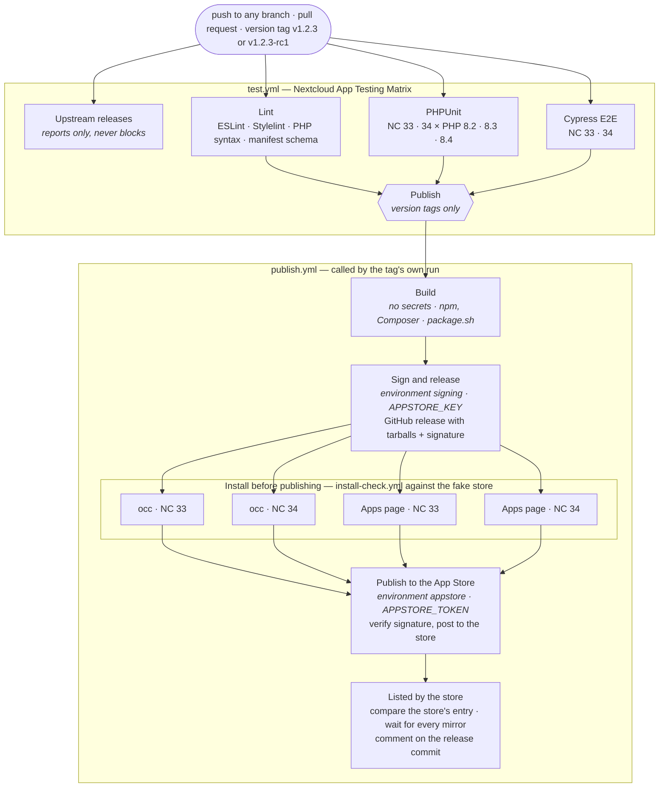

# Nextcloud App Store Publishing

This document describes how FCIAS (`file_checksum_search`) is built, signed, and
published to the Nextcloud App Store.

## Pipeline overview

Publishing is driven by:

- [`package.sh`](../package.sh) — builds and packages the app, signs the
  archive when a key is available, and verifies and posts a signed archive.
- [`.github/workflows/publish.yml`](../.github/workflows/publish.yml) — GitHub
  Actions release pipeline, called by the tag's test run.
- [`.gitlab/gitlab-ci.yml`](../.gitlab/gitlab-ci.yml) — the GitLab CI pipeline, parked (see below).

A release produces:

- `build/file_checksum_search.tar.gz` — unversioned archive.
- `build/file_checksum_search-<version>.tar.gz` — versioned archive.
- `build/file_checksum_search-<version>.tar.gz.signature` — SHA-512 signature
  (only produced when signing is configured).

## Signing

The App Store requires a SHA-512 signature of the archive, generated with:

```bash
openssl dgst -sha512 -sign ~/.nextcloud/certificates/file_checksum_search.key \
  file_checksum_search-<version>.tar.gz | openssl base64
```

`package.sh` performs this automatically. The signing key is resolved in order:

1. `APPSTORE_KEY` / `APPSTORE_CERT` environment variables (PEM content, or a
   path to a file — GitLab file-type variables set the path).
2. `~/.nextcloud/certificates/<app_id>.key` and `.crt` (local development).

The signature is written next to the archive as `<archive>.signature`, printed
to stdout for pasting into the upload form, and verified against the
certificate. If a key is available but no matching certificate is found,
signing now **fails loudly** rather than silently skipping verification —
either provide both, or provide neither to fall back to an unsigned build
(Option B).

## Publishing to the App Store (REST API)

`package.sh --appstore` publishes the built release via the App Store REST API
(`POST /api/v1/apps/releases`). It never signs: it posts the archive's
existing `.signature`, after verifying it against the certificate, and
refuses before any request when that fails. It requires:

- The archive hosted at a public HTTPS URL (`DOWNLOAD_URL` env var).
- The archive's signature next to it (`--sign-only` makes it where the key is).
- The certificate: `APPSTORE_CERT`, or `~/.nextcloud/certificates/<app_id>.crt`.
- An App Store API token: `API_TOKEN` env var or `~/.nextcloud/API_TOKEN.txt`.

`package.sh --verify` runs the same check on its own.

Add `--nightly` to publish the release as a nightly:

```bash
DOWNLOAD_URL=https://example.com/file_checksum_search.tar.gz \
  bash package.sh --appstore --nightly
```

> Note: the app id must already be registered on the App Store (one-time,
> `POST /api/v1/apps`) before the first release can be published.

## GitHub Actions

A release is published from the tag's own test run. The last job of
[`test.yml`](../.github/workflows/test.yml), **Publish**, runs only for a `v*`
tag whose lint, PHPUnit and Cypress jobs passed, and calls
[`publish.yml`](../.github/workflows/publish.yml) as a reusable workflow. Every
publishing job therefore runs with the tag as its ref, which is what an
environment's deployment rules are matched against; a workflow started by
`workflow_run` would carry the default branch there. A release is run again by
hand with `gh workflow run publish.yml --ref <tag>`.

`publish.yml` has three jobs, and each holds at most one secret:

1. **Build** holds none, and is the only job that runs third-party code
   (npm and Composer). It reads the version from `appinfo/info.xml`, refuses a
   tag that does not name it, and classifies the tag: `v0.Y.Z` and any
   `-suffix` tag are nightlies, `vX.Y.Z` with X ≥ 1 is stable, anything else
   publishes nothing. Then it builds and packages with `package.sh` and hands
   the tarballs on as an artifact of the run. It does not lint: the tag's run
   has linted it already.
2. **Sign and release** runs in the `signing` environment, with the key, and
   runs none of the build's code. It signs the tarballs it was handed
   (`package.sh --sign-only`), and creates the GitHub release with the
   changelog section as its body (`changelog.sh notes X.Y.Z`) and both
   tarballs and the signature as its assets; a nightly is marked as a
   pre-release. What is published is what was signed.
3. **Publish to the App Store** runs in the `appstore` environment, with the
   store token and no key. It downloads the versioned tarball and its
   signature from the release anonymously, the way the store will fetch them,
   verifies the signature against the certificate, and posts the tarball's
   URL and the signature to the App Store (`POST /api/v1/apps/releases`), with
   `--nightly` for a nightly. A refusal by the store fails the job, with the
   store's answer in the log.

Between signing and the store, **Install before publishing** runs the install
check ([`install-check.yml`](../.github/workflows/install-check.yml)) against a
fake store: the real store's full listing, served locally with this release
added from its GitHub release (`tests/e2e/store/appstore.py fake`). Fresh
Nextcloud 33 and 34 servers install it with `occ app:install` and through the
Apps page — the Files category's list, the app's row, Download and enable —
then `tests/e2e/store/check-install.sh` checks every install step and a smoke
run of the e2e suite drives the installed copy. The store job waits for it, so
a release that does not install never reaches the store. For a nightly, `occ`
gets `--allow-unstable` and the Apps page's server moves to the `daily`
channel; a stable release installs on servers left as they are.

After the upload nothing is installed again. **Listed by the store**
(`tests/e2e/store/appstore.py watch`) waits until a host of the store's listing
names the release and compares the store's entry with the one the installs
tested — version, channel, download, signature, platform and PHP ranges, and
the certificate; any difference fails it. The store publishes no list of
mirrors: it answers `api/v1/apps.json` itself or redirects to a mirror
(`garm2`, `garm3` when this was written), so the job follows the redirects,
asks every host it has seen, waits until all of them list the release, and
writes into the run's summary how long each took. Then it comments on the
release commit, mentioning `vars.RELEASE_NOTIFY` (or whoever pushed the tag),
which is how GitHub e-mails the maintainers.

Each environment waits for whatever its protection rules ask: a required
reviewer approves the job on the run's page, a wait timer counts down, a tag
rule refuses other refs. The rules are Ruby `File.fnmatch` globs, not regular
expressions; `v[0-9]*.[0-9]*.[0-9]*` is the closest they get to a version tag,
and it admits the `-rc` tags a dry run uses. GitHub creates an environment
without rules the first time a job names it, so create both beforehand.

The secrets:

- `APPSTORE_KEY` (private key PEM, as it is — a secret may hold newlines) in
  the `signing` environment.
- `APPSTORE_TOKEN` (App Store API token) in the `appstore` environment.
- `APPSTORE_CERT` (certificate PEM) as a repository variable, since it is
  public; both jobs use it to verify. A repository secret of that name is
  read when no variable is set.

The key and the certificate must be the pair registered for the app in the
portal — a mismatch causes the store to reject the upload.

The tag reaches GitHub through GitLab's push mirror, so the release procedure
is `changelog.sh cut`, then one push of the branch and the tag to `origin`;
the test run starts on the mirrored tag within a minute, and publishing
follows its tests.

### The jobs at a glance



Each install job ends with `check-install.sh` and a smoke run of the e2e suite.
The release metadata step in **Build** refuses a tag that does not name the
manifest's version or whose commit is not on `master`; the environments'
reviewers and tag rules can hold **Sign and release** and **Publish to the App
Store** as well.

## GitLab CI

Parked since 2026-09-25: the pipeline file sits in
[`.gitlab/`](../.gitlab/README.md), where GitLab does not read it, because
its minutes are billed and GitHub runs the wider matrix for free. GitLab
stays the code host and the source of the push mirror that carries every
commit and tag to GitHub, where the workflows above run. The README beside
the file says how to run it again.

## Manual upload (Option B fallback)

When no signing key is configured, the pipeline still produces a valid unsigned
tarball. To publish manually:

1. Download `file_checksum_search.tar.gz` from the release.
2. Go to the Nextcloud App Store developer portal
   (`https://apps.nextcloud.com/developer/`).
3. Upload the archive and paste its signature (see "Signing" above). Generate
   the signature locally if signing is not configured in CI.
4. Track the release status in the app store dashboard.

## Local packaging

```bash
bash package.sh
```

Place your certificate in `~/.nextcloud/certificates/file_checksum_search.{crt,key}`
to have `package.sh` sign the archive locally. The signature is written to
`build/file_checksum_search-<version>.tar.gz.signature`.

To publish a release directly from the command line (archive must already be
hosted at a public HTTPS URL, and signed):

```bash
bash package.sh --sign-only
DOWNLOAD_URL=https://example.com/file_checksum_search.tar.gz bash package.sh --appstore
```
